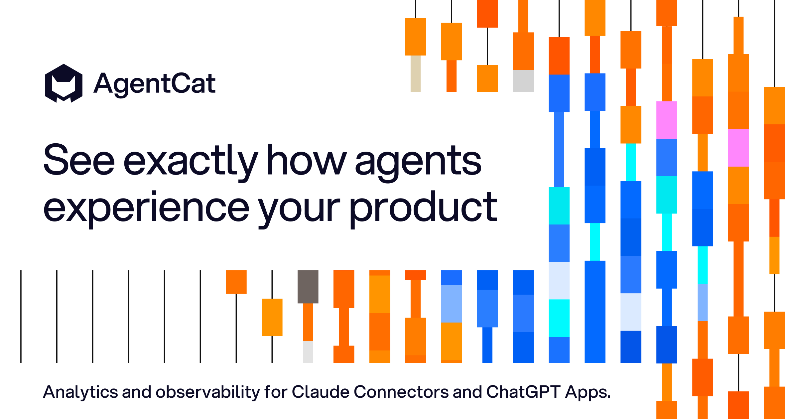

<div align="center">
  
</div>
<h3 align="center">
    <a href="#getting-started">Getting Started</a>
    <span> · </span>
    <a href="#why-use-agentcat-">Features</a>
    <span> · </span>
    <a href="https://docs.agentcat.com">Docs</a>
    <span> · </span>
    <a href="https://agentcat.com">Website</a>
    <span> · </span>
    <a href="#free-for-open-source">Open Source</a>
    <span> · </span>
    <a href="https://meet.agentcat.com/meet">Schedule a Demo</a>
</h3>
<p align="center">
  <a href="https://pkg.go.dev/go.agentcat.com/sdk"></a>
  <a href="https://goreportcard.com/report/go.agentcat.com/sdk"></a>
  <a href="https://opensource.org/licenses/MIT"></a>
  <a href="https://go.dev/"></a>
  <a href="https://github.com/agentcathq/agentcat-go-sdk/issues"></a>
  <a href="https://github.com/agentcathq/agentcat-go-sdk/actions"></a>
</p>

> [!IMPORTANT]
> **MCPcat is now AgentCat** 🐱 — same team, same product, new name. This module was previously published as `github.com/mcpcat/mcpcat-go-sdk`, which keeps working forever, but new features land here. Upgrading takes a few minutes — see the [migration guide](./MIGRATION.md).

> [!NOTE]
> Looking for the Python SDK? Check it out here [agentcat-python](https://github.com/agentcathq/agentcat-python-sdk).

## Why use AgentCat? 🤔

AgentCat helps developers and product owners build, improve, and monitor their MCP servers by capturing user analytics and tracing tool calls.

Use AgentCat for:

- **User session replay** 🎬. Follow alongside your users to understand why they're using your MCP servers, what functionality you're missing, and what clients they're coming from.
- **Trace debugging** 🔍. See where your users are getting stuck, track and find when LLMs get confused by your API, and debug sessions across all deployments of your MCP server.
- **Existing platform support** 📊. Get logging and tracing out of the box for your existing observability platforms (OpenTelemetry, Datadog, Sentry) — eliminating the tedious work of implementing telemetry yourself.


## Supported MCP Libraries

AgentCat provides first-class support for the two most popular Go MCP libraries:

| Library | Install |
|---------|---------|
| [mcp-go](https://github.com/mark3labs/mcp-go) (mark3labs) | `go get go.agentcat.com/sdk/mcpgo` |
| [go-sdk](https://github.com/modelcontextprotocol/go-sdk) (official) | `go get go.agentcat.com/sdk/officialsdk` |

Import the package that matches the MCP library you're already using. Both expose the same `Track()` API and share the same feature set.

## Getting Started

Create an account and obtain your project ID at [agentcat.com](https://agentcat.com). For detailed setup instructions visit our [documentation](https://docs.agentcat.com).

Add one `Track()` call before starting your server:

**mark3labs/mcp-go:**
```go
import agentcat "go.agentcat.com/sdk/mcpgo"

shutdown, err := agentcat.Track(mcpServer, "proj_YOUR_PROJECT_ID", nil)
if err != nil { /* handle error */ }
defer shutdown(context.Background())
```

**Official go-sdk:**
```go
import agentcat "go.agentcat.com/sdk/officialsdk"

shutdown, err := agentcat.Track(mcpServer, "proj_YOUR_PROJECT_ID", nil)
if err != nil { /* handle error */ }
defer shutdown(context.Background())
```

`Track()` returns a shutdown function — call it before your application exits to flush all queued events.

## Advanced Features

### User Identification

Identify your user sessions with a callback to attach user information to every event in a session.

**mark3labs/mcp-go:**
```go
import (
    "github.com/mark3labs/mcp-go/mcp"
    agentcat "go.agentcat.com/sdk/mcpgo"
)

shutdown, err := agentcat.Track(s, "proj_YOUR_PROJECT_ID", &agentcat.Options{
    Identify: func(ctx context.Context, req *mcp.CallToolRequest) *agentcat.UserIdentity {
        return &agentcat.UserIdentity{
            UserID: "user_12345", UserName: "demo_user",
            UserData: map[string]any{"email": "demo@example.com"},
        }
    },
})
```

**Official go-sdk:**
```go
import (
    "github.com/modelcontextprotocol/go-sdk/mcp"
    agentcat "go.agentcat.com/sdk/officialsdk"
)

shutdown, err := agentcat.Track(s, "proj_YOUR_PROJECT_ID", &agentcat.Options{
    Identify: func(ctx context.Context, req *mcp.CallToolRequest) *agentcat.UserIdentity {
        return &agentcat.UserIdentity{
            UserID: "user_12345", UserName: "demo_user",
            UserData: map[string]any{"email": "demo@example.com"},
        }
    },
})
```

### Sensitive Data Redaction

AgentCat redacts all data sent to its servers and encrypts at rest, but for additional security, it offers a hook to do your own redaction on all text data before it leaves your server.

```go
shutdown, err := agentcat.Track(s, "proj_YOUR_PROJECT_ID", &agentcat.Options{
    RedactSensitiveInformation: func(text string) string {
        return emailRegex.ReplaceAllString(text, "[REDACTED]")
    },
})
```

### Debug Mode

Enable debug logging for troubleshooting. Debug logs are written to `~/mcpcat.log`.

```go
shutdown, err := agentcat.Track(s, "proj_YOUR_PROJECT_ID", &agentcat.Options{Debug: true})
```

### Using with Existing Hooks (mcp-go only)

If your server already uses mcp-go hooks, pass them via `Options.Hooks` and AgentCat will append its hooks alongside yours:

```go
shutdown, err := agentcat.Track(s, "proj_YOUR_PROJECT_ID", &agentcat.Options{Hooks: hooks})
```

### Internal diagnostics

To help us catch and fix broken installs, the SDK sends AgentCat a small, anonymized
signal when setup or runtime errors occur — never your tool calls, your responses,
or anything about your users. Records carry only operational metadata, such as your
project ID (or an anonymous install ID when none is set), SDK version, and Go
runtime/OS/arch. Your local `~/mcpcat.log` is unchanged.

Diagnostics are on by default and can be turned off completely with either:

- `agentcat.Options{DisableDiagnostics: true}` passed to `Track`, or
- the `DISABLE_DIAGNOSTICS` environment variable.

## Configuration Options

| Option | Type | Default | Description |
|--------|------|---------|-------------|
| `DisableReportMissing` | `bool` | `false` | When `true`, prevents the `get_more_tools` tool from being registered |
| `DisableToolCallContext` | `bool` | `false` | When `true`, prevents the `context` parameter from being injected on tool calls |
| `Debug` | `bool` | `false` | Enable debug logging to `~/mcpcat.log` |
| `RedactSensitiveInformation` | `func(string) string` | `nil` | Custom redaction applied to all text data before sending |
| `Identify` | callback | `nil` | Attach user information to sessions |
| `Hooks` | `*server.Hooks` | `nil` | Pre-existing hooks to merge with (mcp-go only) |

## Free for open source

AgentCat is free for qualified open source projects. We believe in supporting the ecosystem that makes MCP possible. If you maintain an open source MCP server, you can access our full analytics platform at no cost.

**How to apply**: Email hi@agentcat.com with your repository link

_Already using AgentCat? We'll upgrade your account immediately._

## Community Cats 🐱

Meet the cats behind AgentCat! Add your cat to our community by submitting a PR with your cat's photo in the `docs/cats/` directory.

<div align="left">
  
  
</div>

_Want to add your cat? Create a PR adding your cat's photo to `docs/cats/` and update this section!_
