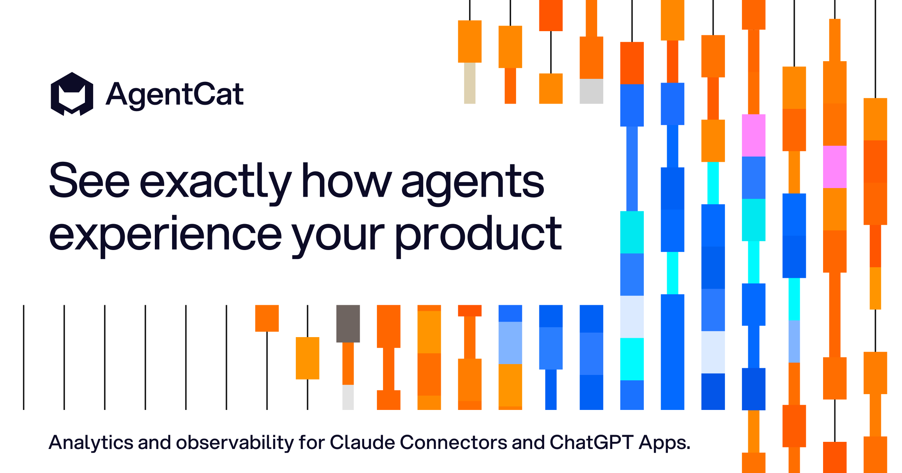

<div align="center">
  
</div>
<h3 align="center">
    <a href="#getting-started">Getting Started</a>
    <span> · </span>
    <a href="#why-use-agentcat-">Features</a>
    <span> · </span>
    <a href="https://docs.agentcat.com">Docs</a>
    <span> · </span>
    <a href="https://agentcat.com">Website</a>
    <span> · </span>
    <a href="#free-for-open-source">Open Source</a>
    <span> · </span>
    <a href="https://meet.agentcat.com/meet">Schedule a Demo</a>
</h3>
<p align="center">
  <a href="https://pkg.go.dev/go.agentcat.com/sdk/v2"></a>
  <a href="https://goreportcard.com/report/go.agentcat.com/sdk/v2"></a>
  <a href="https://opensource.org/licenses/MIT"></a>
  <a href="https://go.dev/"></a>
  <a href="https://github.com/agentcathq/agentcat-go-sdk/issues"></a>
  <a href="https://github.com/agentcathq/agentcat-go-sdk/actions"></a>
</p>

> [!IMPORTANT]
> **AgentCat v2 is out.** MCP 2026-07-28 removed protocol-level sessions, so v2 replaces all transport-session correlation with explicit, stateless session handles and moves to `/v2` import paths. Coming from v1 or from `github.com/mcpcat/mcpcat-go-sdk`? Read the [migration guide](./MIGRATION.md) — it lists every removed API.

> [!NOTE]
> Looking for the Python SDK? Check it out here [agentcat-python](https://github.com/agentcathq/agentcat-python-sdk).

## Why use AgentCat? 🤔

AgentCat helps developers and product owners build, improve, and monitor their MCP servers by capturing user analytics and tracing tool calls.

Use AgentCat for:

- **Task replay** 🎬. Follow a whole agent task end to end — even across stateless deployments — to understand why agents are using your MCP servers, what functionality you're missing, and what clients they're coming from.
- **Trace debugging** 🔍. See where your users are getting stuck, track and find when LLMs get confused by your API, and debug tasks across all deployments of your MCP server.
- **Existing platform support** 📊. Get logging and tracing out of the box for your existing observability platforms (OpenTelemetry, Datadog, Sentry) — eliminating the tedious work of implementing telemetry yourself.


## Supported MCP Libraries

AgentCat provides first-class support for the two most popular Go MCP libraries:

| Library | Supported versions | Installs with | Install |
|---------|--------------------|---------------|---------|
| [mcp-go](https://github.com/mark3labs/mcp-go) (mark3labs) | v0.53.0 – v0.57.0 | v0.57.0 | `go get go.agentcat.com/sdk/mcpgo/v2` |
| [go-sdk](https://github.com/modelcontextprotocol/go-sdk) (official) | v1.4.1 – v1.7.0 | v1.7.0 | `go get go.agentcat.com/sdk/officialsdk/v2` |

A fresh install pulls the newest version, but AgentCat does not force you to
upgrade: if your project pins an older release in the supported range, the
adapter compiles and tracks against it. Every version in the range is tested
with `-race` on each push by the compatibility workflows.

Newer MCP releases carry features older ones cannot express, so a few
capabilities depend on what your pinned version supports:

| On an older version | mcp-go | go-sdk |
|---------------------|--------|--------|
| Integers above 2^53 keep their exact value in arguments and `structuredContent` | v0.56.0+ | always |
| `agentcat_mrtr` tag on multi-round-trip calls | not in mcp-go | v1.7.0+ |
| Per-request client identity from a 2026 client's `_meta` | all | all |

Nothing else changes: session correlation, argument stripping, event capture,
redaction, exporters and the `get_more_tools` tool behave identically across
the whole range. Where a version cannot express a feature, AgentCat reports
its absence rather than guessing — see `mcpgo/compat.go` and
`officialsdk/compat.go`.

Import the package that matches the MCP library you're already using. Both expose the same `Track()` API and share the same feature set. The adapter is the only import you need: it re-exports every type the public API mentions (`UserIdentity`, `Event`, `CustomEventData`, `ExporterConfig`, `AgentCatInstance`), so you never import the root `go.agentcat.com/sdk/v2` module yourself.

## Getting Started

Create an account and obtain your project ID at [agentcat.com](https://agentcat.com). For detailed setup instructions visit our [documentation](https://docs.agentcat.com).

Add one `Track()` call before starting your server:

**mark3labs/mcp-go:**
```go
import agentcat "go.agentcat.com/sdk/mcpgo/v2"

shutdown, err := agentcat.Track(mcpServer, "proj_YOUR_PROJECT_ID", nil)
if err != nil { log.Fatal(err) } // on error shutdown is nil — do not defer it
defer shutdown(context.Background())
```

**Official go-sdk:**
```go
import agentcat "go.agentcat.com/sdk/officialsdk/v2"

shutdown, err := agentcat.Track(mcpServer, "proj_YOUR_PROJECT_ID", nil)
if err != nil { log.Fatal(err) } // on error shutdown is nil — do not defer it
defer shutdown(context.Background())
```

`Track()` returns a shutdown function — call it before your application exits to flush all queued events.

## How AgentCat correlates calls

MCP 2026-07-28 has no protocol sessions, and the deployment it assumes is stateless: a load balancer in front of many processes, a fresh server per request, nothing carried between calls. AgentCat v2 therefore correlates work with an **explicit handle that travels on the wire**:

- AgentCat adds an **optional `session_id` string parameter** to each advertised tool. It is never marked `required`, so a call that omits it always succeeds. A tool that already declares its own `session_id` keeps it: AgentCat skips **that one parameter**, still injecting the others, and logs an error explaining that calls to that tool will publish without a session. A tool whose input schema is a composed `oneOf`/`allOf`/`anyOf` gets no injected parameters at all.
- On the first call of a task the agent has no `session_id` to send, so AgentCat mints one (`ses_…`) and tells the agent to echo it back, as a trailing `[MCP INSTRUCTIONS]` text block. That block is added **only** on the call that minted.
- Tools that declare a plain-object output schema additionally get an `_mcp_instructions` field inside `structuredContent` on **every** response — carrying the minting instructions on the call that minted, and confirming the handles in force on every call after that.
- Every later call carries that `session_id`. **AgentCat trusts only handles it issued** — a `ses_` prefix plus a 27-character KSUID. A value in the right shape is used verbatim, so any process in your fleet attributes the call to the same session. Anything else is rejected: the call publishes **without a session** and the agent is told to re-send the ID it was given, rather than being handed a new one. `Event.SessionId` is exempt from both redaction hooks, so a value AgentCat adopted there could never be scrubbed afterwards — which is why it adopts nothing it did not mint.
- Before your handler runs, AgentCat **strips the parameters it injected** — `session_id`, `agent_id`, and `context` never reach your tool code. Stripping is driven by what was actually injected per tool, so a parameter of the same name that AgentCat did *not* inject (your own `context`, say) is passed through to you untouched.
- The mint-back is **wire-only**. The event AgentCat publishes carries your customer's raw, unstripped request and your original, undecorated response.

The session ID rides in the existing `sessionId` event field, so dashboards, exporters, and the `RedactEvent` hook are unaffected. Every event carries an `agentcat_session_id_source` tag recording how its session was decided: `minted`, `supplied`, `hook`, `invalid` (a handle this server never issued) or `foreign` (a `session_id` parameter that belongs to your tool, not to AgentCat). The last two publish sessionless.

**v2 publishes exactly two event types: `mcp:tools/call` and `agentcat:custom`.** `mcp:initialize`, `mcp:tools/list`, `agentcat:identify`, and all resource and prompt events are gone.

## Advanced Features

### Agent tracking

Set `EnableAgentTracking` (off by default) to also inject an **`agent_id`** parameter, so parallel agents and subagents working the same task can be told apart. Where it is injected it is marked `required` in the advertised schema (unlike `session_id`) and the agent chooses its own value — but an omitted `agent_id` still never rejects the call; the event simply publishes without agent identity. The value is carried on the event as a tag.

Injection is best-effort per tool, exactly like `session_id` and `context`: a tool that already declares its own `agent_id` keeps it, and a tool whose input schema is composed (`oneOf`/`allOf`/`anyOf`) or unreadable is left alone.

```go
shutdown, err := agentcat.Track(s, "proj_YOUR_PROJECT_ID", &agentcat.Options{
    EnableAgentTracking: true,
})
```

### Hook mode: bring your own correlation ID

If you already have a correlation ID — a workflow ID, a trace ID, a thread ID — configure `ResolveSessionID` and AgentCat switches to **hook mode**: it injects **no `session_id` parameter anywhere** and never shows session instructions to the agent. You own correlation. The string you return is deterministically derived (together with your project ID) into a `ses_` session ID, so the same value always maps to the same session across processes, restarts, and languages. Return `""` or an error to silently mint a random session for that one call.

The hook runs on every tool call — keep it cheap.

**mark3labs/mcp-go:**
```go
import (
    "github.com/mark3labs/mcp-go/mcp"
    agentcat "go.agentcat.com/sdk/mcpgo/v2"
)

shutdown, err := agentcat.Track(s, "proj_YOUR_PROJECT_ID", &agentcat.Options{
    ResolveSessionID: func(ctx context.Context, request mcp.CallToolRequest) (string, error) {
        return workflowIDFromContext(ctx), nil
    },
})
```

**Official go-sdk:**
```go
import (
    "github.com/modelcontextprotocol/go-sdk/mcp"
    agentcat "go.agentcat.com/sdk/officialsdk/v2"
)

shutdown, err := agentcat.Track(s, "proj_YOUR_PROJECT_ID", &agentcat.Options{
    ResolveSessionID: func(ctx context.Context, request mcp.Request) (string, error) {
        return workflowIDFromContext(ctx), nil
    },
})
```

### Stateless deployments and per-request server factories

Building a fresh server for every HTTP request is the expected 2026 topology, and it is fully supported: **call `Track()` inside the factory.**

```go
handler := mcp.NewStreamableHTTPHandler(func(r *http.Request) *mcp.Server {
    s := newServer()
    if _, err := agentcat.Track(s, "proj_YOUR_PROJECT_ID", nil); err != nil {
        log.Printf("agentcat: %v", err) // never fail a request over analytics
    }
    return s
}, &mcp.StreamableHTTPOptions{Stateless: true})
```

- Module-level state (the publisher, the logger, diagnostics) initializes **once**, however many servers you track. Per-server state is released automatically when the server becomes unreachable, so a per-request factory does not leak.
- Ignore the shutdown function `Track()` returns inside the factory; the publisher is process-wide, so drain it once at exit with `agentcat.Shutdown(ctx)`.
- **Rebuild on demand**: a stateless client can send `tools/call` to a process that never served a `tools/list`. AgentCat rebuilds its injection registries from that server's own tool list on the first call, so arguments are still stripped and the mint-back still reaches the agent.

A complete runnable program is in [`examples/officialsdk/factory`](examples/officialsdk/factory).

### User Identification

Attach user information to a call's event with the `Identify` callback. In v2 it runs **on every tool call**, uncached, and stamps only that one event — there is no session to merge into and no `agentcat:identify` event. Because it is on the hot path of every call, keep it cheap: read from the context, headers, or an already-parsed token, and make **no network calls**. Return `nil` (or an identity with an empty `UserID`) to skip identification for a call.

**mark3labs/mcp-go:**
```go
import (
    "github.com/mark3labs/mcp-go/mcp"
    agentcat "go.agentcat.com/sdk/mcpgo/v2"
)

shutdown, err := agentcat.Track(s, "proj_YOUR_PROJECT_ID", &agentcat.Options{
    Identify: func(ctx context.Context, request any) *agentcat.UserIdentity {
        req := request.(*mcp.CallToolRequest) // always a tool call in v2
        _ = req // extract identity from the request, ctx, headers, or an auth token
        return &agentcat.UserIdentity{
            UserID: "user_12345", UserName: "demo_user",
            UserData: map[string]any{"email": "demo@example.com"},
        }
    },
})
```

**Official go-sdk:**
```go
import (
    "github.com/modelcontextprotocol/go-sdk/mcp"
    agentcat "go.agentcat.com/sdk/officialsdk/v2"
)

shutdown, err := agentcat.Track(s, "proj_YOUR_PROJECT_ID", &agentcat.Options{
    Identify: func(ctx context.Context, request mcp.Request) *agentcat.UserIdentity {
        req := request.(*mcp.CallToolRequest) // always a tool call in v2
        _ = req // extract identity from the request, ctx, headers, or an auth token
        return &agentcat.UserIdentity{
            UserID: "user_12345", UserName: "demo_user",
            UserData: map[string]any{"email": "demo@example.com"},
        }
    },
})
```

### Custom Events

Publish your own events alongside the automatic ones with `PublishCustomEvent`. The first argument is either a **session ID string**, used **verbatim** as the event's session (no derivation, no validation — so it correlates with whatever handle you already hold), or a **tracked server**, in which case the event publishes with no session unless you supply one. A non-empty `CustomEventData.SessionID` always wins.

```go
// Attribute the event to a session the agent is already using.
err := agentcat.PublishCustomEvent("ses_abc123", "proj_YOUR_PROJECT_ID", &agentcat.CustomEventData{
    ResourceName: "invoice.exported",
    Message:      "user exported the quarterly invoice",
    Properties:   map[string]any{"rows": 4218},
})

// Or pass the tracked server and name the session explicitly.
err = agentcat.PublishCustomEvent(s, "proj_YOUR_PROJECT_ID", &agentcat.CustomEventData{
    SessionID:       "ses_abc123",
    ResourceName: "invoice.exported",
})
```

### Sensitive Data Redaction

AgentCat redacts all data sent to its servers and encrypts at rest, but for additional security, it offers a hook to do your own redaction on all text data before it leaves your server.

```go
shutdown, err := agentcat.Track(s, "proj_YOUR_PROJECT_ID", &agentcat.Options{
    RedactSensitiveInformation: func(text string) string {
        return emailRegex.ReplaceAllString(text, "[REDACTED]")
    },
})
```

For redaction decisions that need more context than a single string — such as which tool was called or what type of event is being published — use the event-level `RedactEvent` hook. It receives the full event object and returns a modified event, or `nil` to drop the event entirely. It can be combined with `RedactSensitiveInformation`.

```go
shutdown, err := agentcat.Track(s, "proj_YOUR_PROJECT_ID", &agentcat.Options{
    RedactEvent: func(event *agentcat.Event) (*agentcat.Event, error) {
        // Drop events from tools that handle secrets entirely
        if event.GetResourceName() == "get_credentials" {
            return nil, nil
        }
        // Strip response payloads from a specific tool
        if event.GetResourceName() == "export_report" {
            event.Response = nil
        }
        return event, nil
    },
})
```

When both hooks are configured, `RedactEvent` runs first and sees the raw, unredacted values; `RedactSensitiveInformation` then runs on its output as a final string-level scrub. The system-managed fields `Id`, `SessionId` (which carries the session ID), `ProjectId`, `EventType`, and `Timestamp` cannot be changed by the hook, and if the hook returns an error or panics, the event is dropped.

### Telemetry Exporters

Send every captured event to your existing observability stack — in addition to (or instead of) the AgentCat platform. Four exporters are available: `otlp`, `datadog`, `sentry`, and `posthog`. Exporters run fire-and-forget in parallel with the AgentCat API send; an exporter failure never affects your server or the other exporters.

```go
shutdown, err := agentcat.Track(s, "proj_YOUR_PROJECT_ID", &agentcat.Options{
    Exporters: map[string]agentcat.ExporterConfig{
        // OpenTelemetry (any OTLP/HTTP collector; /v1/traces is appended automatically)
        "otlp": {
            Type:     "otlp",
            Endpoint: "http://localhost:4318",
            Headers:  map[string]string{"Authorization": "Bearer TOKEN"}, // optional
        },
        // Datadog (logs + metrics)
        "datadog": {
            Type:    "datadog",
            APIKey:  os.Getenv("DD_API_KEY"),
            Site:    "datadoghq.com", // or datadoghq.eu, us3.datadoghq.com, ...
            Service: "my-mcp-server",
            Env:     "production", // optional
        },
        // Sentry (logs always; error events create Issues; transactions with EnableTracing)
        "sentry": {
            Type:          "sentry",
            DSN:           os.Getenv("SENTRY_DSN"),
            Environment:   "production", // optional
            Release:       "1.2.3",      // optional
            EnableTracing: true,         // optional, default false
        },
        // PostHog (batch capture; $exception on errors; $ai_span with EnableAITracing)
        "posthog": {
            Type:            "posthog",
            APIKey:          os.Getenv("POSTHOG_API_KEY"),
            Host:            "https://us.i.posthog.com", // optional, default shown
            EnableAITracing: true,                       // optional, default false
        },
    },
})
```

**Telemetry-only mode**: pass an empty project ID (`""`) with at least one exporter configured, and events go only to your exporters — no AgentCat account required.

```go
shutdown, err := agentcat.Track(s, "", &agentcat.Options{
    Exporters: map[string]agentcat.ExporterConfig{
        "otlp": {Type: "otlp", Endpoint: "http://localhost:4318"},
    },
})
```

### Debug Mode

Enable debug logging for troubleshooting. Debug logs are written to `~/agentcat.log`.

```go
shutdown, err := agentcat.Track(s, "proj_YOUR_PROJECT_ID", &agentcat.Options{Debug: true})
```

### Using with Existing Hooks (mcp-go only)

Nothing to configure — register your hooks the normal way, with `server.WithHooks` at construction, and AgentCat appends its own to them. It reads them back with `MCPServer.GetHooks()`, so the v1 `Options.Hooks` field is gone (it existed only to hand AgentCat hooks it can now find itself). If your server was built without hooks, AgentCat installs a fresh set.

```go
import (
    "github.com/mark3labs/mcp-go/mcp"
    "github.com/mark3labs/mcp-go/server"
    agentcat "go.agentcat.com/sdk/mcpgo/v2"
)

myHooks := &server.Hooks{}
myHooks.AddBeforeCallTool(func(ctx context.Context, id any, message *mcp.CallToolRequest) {
    log.Printf("about to call %s", message.Params.Name)
})

s := server.NewMCPServer("my-server", "1.0.0", server.WithHooks(myHooks))

shutdown, err := agentcat.Track(s, "proj_YOUR_PROJECT_ID", nil) // your hooks still run
```

### Internal diagnostics

To help us catch and fix broken installs, the SDK sends AgentCat a small, anonymized
signal when setup or runtime errors occur — never your tool calls, your responses,
or anything about your users. Records carry only operational metadata, such as your
project ID (or an anonymous install ID when none is set), SDK version, and Go
runtime/OS/arch. Your local `~/agentcat.log` is unchanged.

Diagnostics are on by default and can be turned off completely with either:

- `agentcat.Options{DisableDiagnostics: true}` passed to `Track`, or
- the `DISABLE_DIAGNOSTICS` environment variable.

## Configuration Options

Both adapters expose the same `Options` fields, and only the request-taking callbacks differ in signature:

| Callback | mcpgo | Official go-sdk |
|----------|-------|-----------------|
| `Identify`, `EventTags`, `EventProperties` | `request any` | `request mcp.Request` |
| `ResolveSessionID` | `request mcp.CallToolRequest` (a value) | `request mcp.Request` |

All four fire only on tool calls, and in every case the value passed is the `*mcp.CallToolRequest` that triggered the event — except mcpgo's `ResolveSessionID`, which receives the request by value. The two redaction hooks (`RedactSensitiveInformation`, `RedactEvent`) take no request at all.

| Option | Type | Default | Description |
|--------|------|---------|-------------|
| `DisableReportMissing` | `bool` | `false` | When `true`, prevents the `get_more_tools` tool from being registered |
| `DisableToolCallContext` | `bool` | `false` | When `true`, prevents the `context` parameter from being injected on tool calls |
| `DisableTracing` | `bool` | `false` | When `true`, publishes no events **and** injects no `session_id`/`agent_id` handles; `context` and `get_more_tools` still honor their own flags |
| `CustomContextDescription` | `string` | `""` | Overrides the description of the injected `context` parameter; only applies when context injection is enabled |
| `EnableAgentTracking` | `bool` | `false` | When `true`, injects an agent-self-chosen `agent_id` parameter into tool schemas (marked `required` where injected, best-effort per tool); an omitted value never rejects the call |
| `ResolveSessionID` | callback | `nil` | Hook mode: return your own correlation ID and AgentCat derives the session from it. No `session_id` is injected and no session instructions are shown. Runs on every tool call — keep it cheap |
| `Debug` | `bool` | `false` | Enable debug logging to `~/agentcat.log` |
| `Identify` | callback | `nil` | Runs on every tool call, uncached, and stamps that one event with the returned identity. There is no identity cache and no identify event — keep it cheap, with no network calls |
| `EventTags` | callback | `nil` | Returns string key-value tags for the event. Keys ≤32 chars matching `[a-zA-Z0-9$_.:\- ]`, values ≤200 chars without newlines, ≤50 entries; invalid entries are dropped with a warning |
| `EventProperties` | callback | `nil` | Returns arbitrary JSON metadata to attach to the event (no validation applied) |
| `RedactSensitiveInformation` | `func(string) string` | `nil` | Custom redaction applied to all text data before sending |
| `RedactEvent` | `func(*Event) (*Event, error)` | `nil` | Event-level redaction hook; rewrite the full event or return `nil` to drop it |
| `DisableDiagnostics` | `bool` | `false` | Turns off AgentCat's anonymized SDK diagnostics; also settable via the `DISABLE_DIAGNOSTICS` env var |
| `APIBaseURL` | `string` | `https://api.agentcat.com` | Override the AgentCat API endpoint; falls back to `AGENTCAT_API_URL`, then the legacy `MCPCAT_API_URL` env var |
| `Exporters` | `map[string]ExporterConfig` | `nil` | Telemetry exporters (`otlp`, `datadog`, `sentry`, `posthog`); with at least one exporter, the project ID may be empty (telemetry-only mode) |

## Free for open source

AgentCat is free for qualified open source projects. We believe in supporting the ecosystem that makes MCP possible. If you maintain an open source MCP server, you can access our full analytics platform at no cost.

**How to apply**: Email hi@agentcat.com with your repository link

_Already using AgentCat? We'll upgrade your account immediately._

## Community Cats 🐱

Meet the cats behind AgentCat! Add your cat to our community by submitting a PR with your cat's photo in the `docs/cats/` directory.

<div align="left">
  
  
</div>

_Want to add your cat? Create a PR adding your cat's photo to `docs/cats/` and update this section!_
